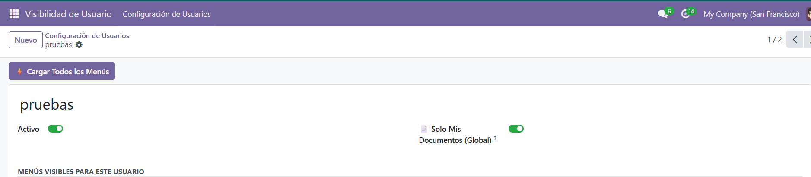
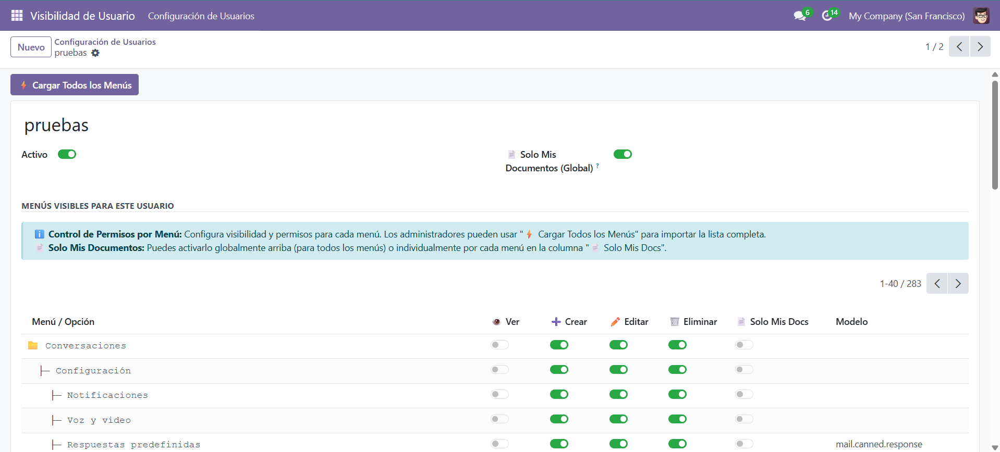
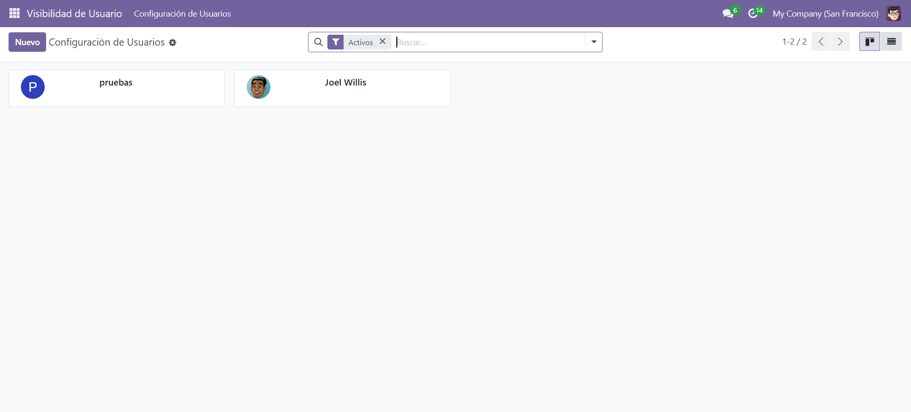

<div align="center">
  

  # User Visibility Menu

  **Odoo 18.0 Community** · Administration · `OPL-1`

  Control exactly what each user can **see** and **do** in Odoo — without
  touching security groups or writing a single line of code.
</div>

---

## The problem

Hiding a menu or removing a "Create" button for one user in Odoo normally means
creating a custom security group, a record rule, and often a custom module. It is
slow, it is fragile, and it affects everyone in the group.

## What this module does

Gives an administrator a per-user switchboard over menus, CRUD buttons and
record scope — applied in memory, with no changes to the underlying security model.

| Feature | Description |
|---|---|
| **Per-user menu visibility** | Show or hide any menu with a switch. Hiding a parent hides its children automatically. |
| **Per-menu CRUD permissions** | Independent Create / Edit / Delete control per menu — even for menus sharing a model (Quotations ≠ Sales Orders). |
| **"Only my documents" filter** | Per-menu or global switch restricting lists to records created by or assigned to the current user. |
| **Product form lockdown** | Prevents opening individual product records without disabling the model. |
| **Instant effect** | Permission changes apply immediately — no server restart. |
| **Bulk menu import** | One-click import of every menu in the system (admin only). |
| **Field visibility** | Optionally hide specific fields per model and user. |

## Screenshots

<div align="center">
  
  
  
</div>

## How it works

The module overrides `get_views()` on Odoo's `base` model and rewrites the view
**arch in memory** before it is sent to the browser, adjusting the `create`,
`edit`, `delete`, `duplicate` and `import` attributes per user and per menu.

Nothing is written to the database and nothing changes for other users.

Menu detection uses `options.action_id` — which Odoo 18 always sends — so menus
sharing a model (e.g. Quotations and Sales Orders on `sale.order`, or Invoices
and Credit Notes on `account.move`) are always treated independently.

## Installation

```bash
cp -r menu_control_visibilidad /path/to/odoo/addons/
# Restart Odoo, update the apps list, install "User Visibility Menu"
```

## Documentation

[Quickstart](menu_control_visibilidad/QUICKSTART.md) ·
[Installation](menu_control_visibilidad/INSTALL.md) ·
[Hierarchical view](menu_control_visibilidad/VISTA_JERARQUICA.md) ·
[Changelog](menu_control_visibilidad/CHANGELOG.md)

## License & author

`OPL-1` — commercial module by
[Consultores Odoo Colombia](https://consultoresodoocolombia.odoo.com/).
Developed by **Juan Carlos Arias Botero**.
